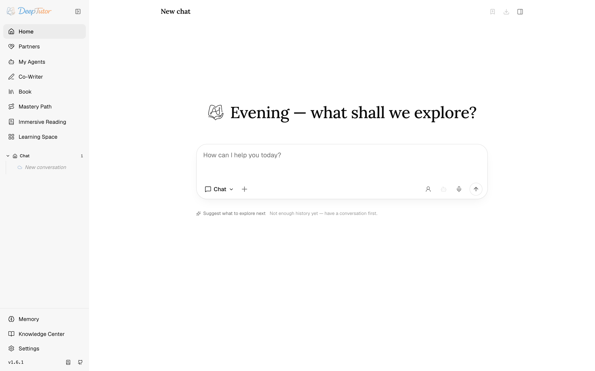
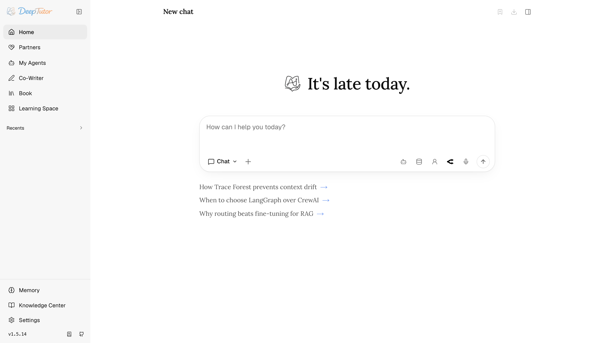
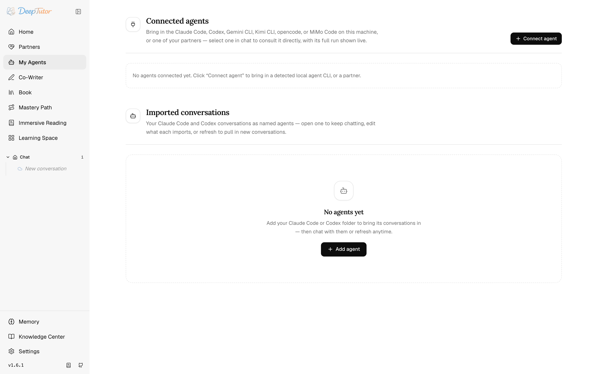
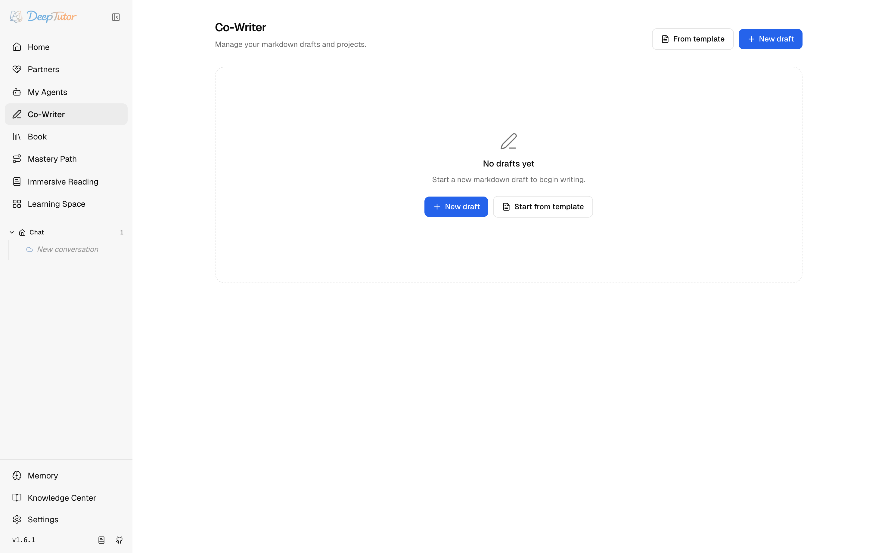
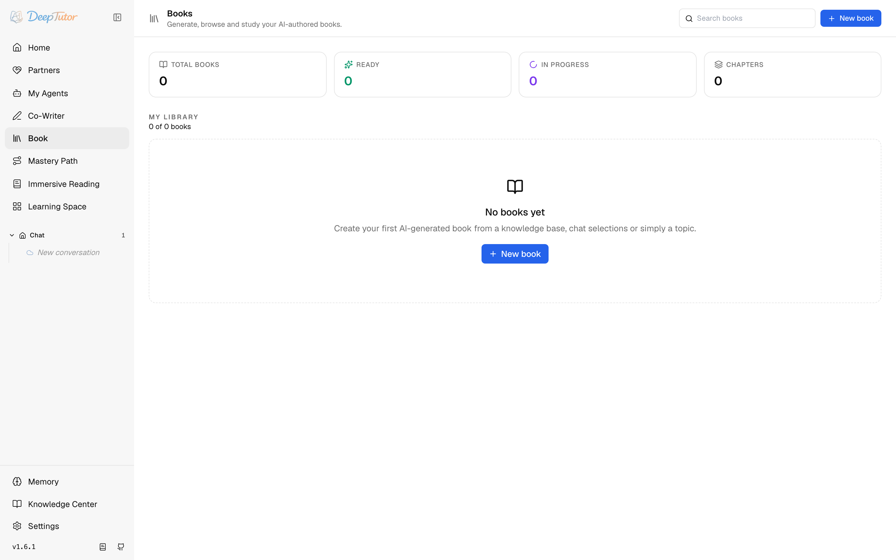
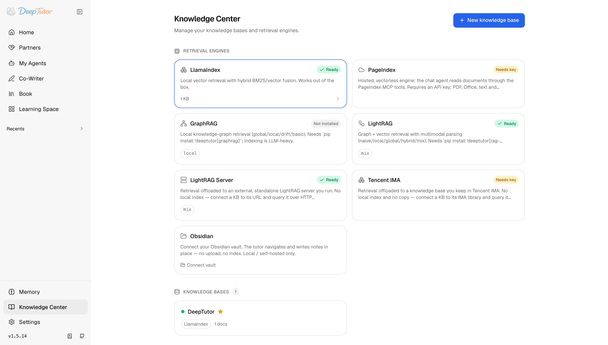
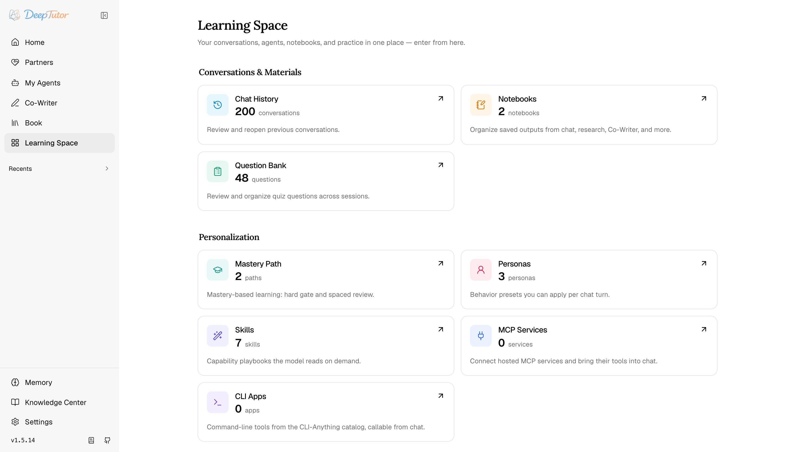
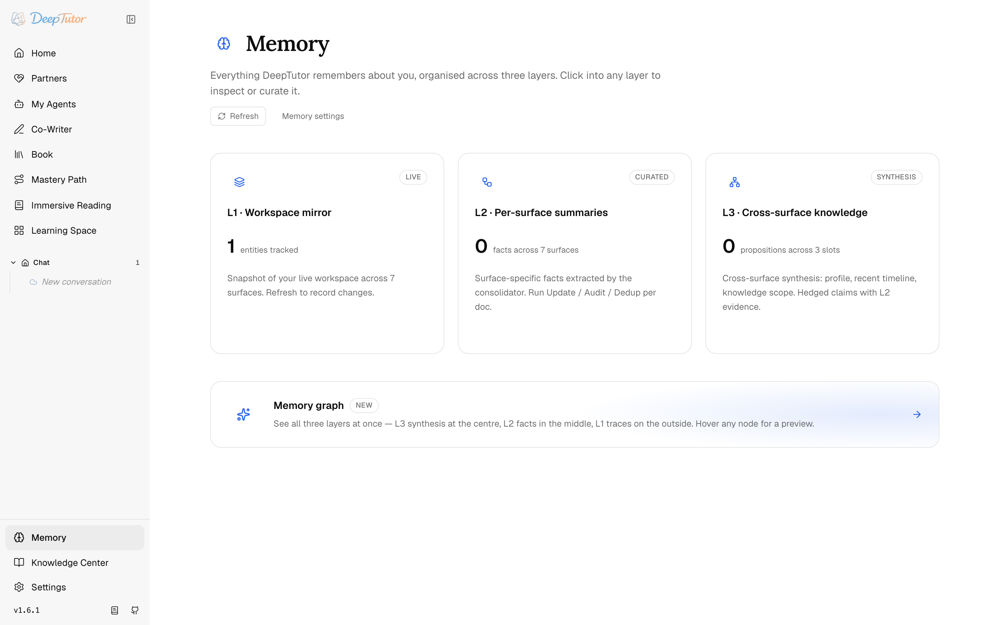

<div align="center">

<p align="center">&nbsp;</p>

# DeepTutor：終身個人化學習導師

<p align="center">
  <a href="https://deeptutor.info" target="_blank"></a>&nbsp;
  <a href="https://deeptutor.info/collaborate/" target="_blank"></a>
</p>

<p align="center">
  <a href="https://trendshift.io/repositories/17099?utm_source=repository-badge&amp;utm_medium=badge&amp;utm_campaign=badge-repository-17099" target="_blank" rel="noopener noreferrer"></a>&nbsp;
  <a href="https://trendshift.io/repositories/17099?utm_source=trendshift-badge&amp;utm_medium=badge&amp;utm_campaign=badge-trendshift-17099" target="_blank" rel="noopener noreferrer"></a>&nbsp;
  <a href="https://trendshift.io/repositories/17099?utm_source=trendshift-badge&amp;utm_medium=badge&amp;utm_campaign=badge-trendshift-17099" target="_blank" rel="noopener noreferrer"></a>
</p>

<p align="center">
  <a href="../../README.md"></a>&nbsp;
  <a href="README_CN.md"></a>&nbsp;
  <a href="README_TW.md"></a>&nbsp;
  <a href="README_JA.md"></a>&nbsp;
  <a href="README_ES.md"></a>&nbsp;
  <a href="README_FR.md"></a>&nbsp;
  <a href="README_AR.md"></a>&nbsp;
  <a href="README_RU.md"></a>&nbsp;
  <a href="README_HI.md"></a>&nbsp;
  <a href="README_PT.md"></a>&nbsp;
  <a href="README_TH.md"></a>&nbsp;
  <a href="README_PL.md"></a>
</p>

[](https://www.python.org/downloads/)
[](https://nextjs.org/)
[](../../LICENSE)
[](https://github.com/HKUDS/DeepTutor/releases)
[](https://arxiv.org/abs/2604.26962)

[](https://discord.gg/eRsjPgMU4t)
[](../../Communication.md)
[](https://github.com/HKUDS/DeepTutor/issues/78)

[主要功能](#-主要功能) · [開始使用](#-開始使用) · [探索](#-探索-deeptutor) · [CLI](#️-deeptutor-cli--代理程式原生介面) · [生態系](#-生態系--eduhub-與技能社群) · [社群](#-社群)

</div>

---

> 🤝 **我們歡迎任何形式的貢獻！** 歡迎在 [`Roadmap`](https://github.com/HKUDS/DeepTutor/issues/498) 為規劃項目投票或提出新構想，並參閱[貢獻指南](../../CONTRIBUTING.md)，了解分支策略、程式碼規範與參與方式。

### 📰 最新消息

- **2026-05-22** 🌐 官方文件網站 [**deeptutor.info**](https://deeptutor.info/) 正式上線 — 指南、參考資料與能力導覽集中在同一處。
- **2026-04-19** 🎉 111 天內突破 2 萬顆 Star！感謝大家對真正個人化智慧教學的支持。
- **2026-04-10** 📄 論文已登上 arXiv — 閱讀[預印本](https://arxiv.org/abs/2604.26962)，了解 DeepTutor 背後的設計與理念。
- **2026-02-06** 🚀 僅 39 天便突破 1 萬顆 Star！衷心感謝傑出的社群。
- **2026-01-01** 🎊 新年快樂！加入我們的 [Discord](https://discord.gg/eRsjPgMU4t)、[WeChat](https://github.com/HKUDS/DeepTutor/issues/78) 或 [Discussions](https://github.com/HKUDS/DeepTutor/discussions) — 一起塑造 DeepTutor。
- **2025-12-29** 🎓 DeepTutor 正式發布！

## ✨ 主要功能

DeepTutor 是代理程式原生的學習工作區，在同一個可擴充系統中串聯教學、解題、測驗生成、研究、視覺化與精熟練習。

- **所有模式共用一套執行階段** — Chat、Quiz、Research、Visualize、Solve、Mastery Path 與 Immersive Reading 在同一個代理程式迴圈上運作；你切換的是目標而非引擎，學習情境會一路跟隨學習者。
- **相互連結的學習情境** — 知識庫、書籍、Co-Writer 草稿、筆記本、題庫、角色設定與 Memory 在每個工作流程中皆可使用，不再分散於彼此隔離的工具。
- **子代理程式與 Partners** — 可在任何回合諮詢即時程式設計 CLI（Claude Code、Codex、Gemini、Kimi、opencode 或 MiMo）或 Partner（也能匯入其過往對話），並讓持續運作的 IM 夥伴共用同一套核心。
- **多引擎知識系統** — 透過 LlamaIndex、PageIndex、GraphRAG、LightRAG、遠端 LightRAG Server 或 Tencent IMA 知識庫，或連結的 Obsidian vault 建立版本化 RAG 知識庫，並支援可插拔的文件解析。
- **可擴充的工具與技能** — 內建工具、MCP 伺服器、CLI 應用程式、影像／影片／語音生成模型，以及可從 EduHub 安裝的社群技能。
- **可檢視的記憶** — L1 軌跡、L2 介面摘要與 L3 綜整讓個人化內容透明且可編輯；Memory Graph 可將每項主張追溯到其證據。

---

## 🚀 開始使用

DeepTutor 提供四種安裝方式。它們共用相同的工作區配置：設定會儲存在啟動目錄下的 `data/user/settings/`（若明確設定 `DEEPTUTOR_HOME` 或 `deeptutor start --home`，則儲存在該位置）。完整應用程式的建議流程是：**選擇工作區目錄 → 安裝 → `deeptutor init` → `deeptutor start`**。

<details>
<summary><b>方式一 — 從 PyPI 安裝</b> · 完整本機 Web 應用程式＋CLI，無須 clone</summary>

完整本機 Web 應用程式＋CLI，無須 clone。需要 **Python 3.11–3.13**，且 PATH 中須有 **Node.js 20+** 執行階段（`deeptutor start` 會啟動套件內的 Next.js standalone 伺服器）。

```bash
mkdir -p my-deeptutor && cd my-deeptutor
pip install -U deeptutor
deeptutor init     # prompts for ports + LLM provider + optional embedding
deeptutor start    # starts backend + frontend; keep the terminal open
```

`deeptutor init` 會引導你設定後端連接埠（預設 `8001`）、前端連接埠（預設 `3782`）、LLM 供應商／Base URL／API key／模型，以及 Knowledge Base／RAG 選用的 embedding 供應商。

執行 `deeptutor start` 後，開啟終端機顯示的前端 URL；預設為 [http://127.0.0.1:3782](http://127.0.0.1:3782)。在該終端機按下 `Ctrl+C`，即可同時停止後端與前端。若只是快速試用，也可以略過 `deeptutor init`；應用程式會以預設連接埠與空白模型設定啟動，之後再到 **Settings → Models** 設定即可。

</details>

<details>
<summary><b>方式二 — 從原始碼安裝</b> · 針對 checkout 進行開發</summary>

適合針對原始碼 checkout 進行開發。請使用 **Python 3.11–3.13** 與 **Node.js 22 LTS**，以符合 CI 和 Docker 環境。

```bash
git clone https://github.com/HKUDS/DeepTutor.git
cd DeepTutor

# Create a venv (macOS/Linux). Windows PowerShell:
#   py -3.11 -m venv .venv ; .\.venv\Scripts\Activate.ps1
python3 -m venv .venv && source .venv/bin/activate
python -m pip install --upgrade pip

# Install backend + frontend deps
python -m pip install -e .
( cd web && npm ci --legacy-peer-deps )

deeptutor init
deeptutor start --dev
```

`deeptutor start` 會先為本機 `web/` 前端建立一次正式環境版本，之後重複使用；`--dev` 則會以 HMR 執行 Next.js。設定配置、連接埠與 `Ctrl+C` 停止方式皆與方式一相同。

<details>
<summary><b>Conda 環境</b>（取代 <code>venv</code>）</summary>

```bash
conda create -n deeptutor python=3.11
conda activate deeptutor
python -m pip install --upgrade pip
```

</details>

<details>
<summary><b>選用的額外安裝項目</b> — dev／partners／matrix／math-animator</summary>

```bash
pip install -e ".[dev]"             # tests/lint tools
pip install -e ".[partners]"        # Partner IM channel SDKs + MCP client
pip install -e ".[matrix]"          # Matrix channel without E2EE/libolm
pip install -e ".[matrix-e2e]"      # Matrix E2EE; requires libolm
pip install -e ".[math-animator]"   # Manim addon; requires LaTeX/ffmpeg/system libs
```

</details>

<details>
<summary><b>調整前端相依套件與開發伺服器疑難排解</b></summary>

**變更前端相依套件：** 執行 `npm install --legacy-peer-deps` 以更新 `web/package-lock.json`，接著同時提交 `web/package.json` 與 `web/package-lock.json`。

**開發伺服器卡住：** 若 `deeptutor start --dev` 回報已有前端處理程序但該處理程序沒有回應，請停止訊息中顯示的 PID。若實際上並無 Next.js 處理程序執行，代表 lock 檔已過期；移除後再試一次：

```bash
rm -f web/.next/dev/lock web/.next/lock
deeptutor start --dev
```

</details>

</details>

<details>
<summary><b>方式三 — Docker</b> · 單一自足式容器</summary>

以單一容器執行完整 Web 應用程式。映像檔位於 GitHub Container Registry：

- `ghcr.io/hkuds/deeptutor:latest` — 穩定版本
- `ghcr.io/hkuds/deeptutor:pre` — 有提供時為預先發行版本

> 如需 podman／rootless／唯讀 rootfs 部署及各安裝方式的完整指南，請參閱 [CONTAINERIZATION.md](../../CONTAINERIZATION.md)。

```bash
docker run --rm --name deeptutor \
  -p 127.0.0.1:3782:3782 \
  -v deeptutor-data:/app/data \
  ghcr.io/hkuds/deeptutor:latest
```

> **只需要發布 `3782`。** 瀏覽器只會與前端 origin 通訊；Next.js middleware（`web/proxy.ts`）會將 `/api/*` 與 `/ws/*` 轉送到容器**內部**的 FastAPI 後端。發布 `8001`（`-p 127.0.0.1:8001:8001`）並非必要；只有在你想直接以 curl 或指令碼呼叫 API 時才方便。

開啟 [http://127.0.0.1:3782](http://127.0.0.1:3782)。容器會在首次啟動時建立 `/app/data/user/settings/*.json`；請從 Web 設定頁面設定模型供應商。設定、API key、記錄、工作區檔案、記憶與知識庫都會保留在 `deeptutor-data` volume 中。

- **不同的主機連接埠：** 變更各 `-p host:container` 對應左側的值（例如 `-p 127.0.0.1:8088:3782`）。若你在 `/app/data/user/settings/system.json` 變更容器側連接埠，請重新啟動，並同步更新各對應右側的值。
- **背景執行：** 加上 `-d`；接著以 `docker logs -f deeptutor` 查看記錄、`docker stop deeptutor` 停止，並在重複使用名稱前執行 `docker rm deeptutor`。`deeptutor-data` volume 會在重新啟動後保留設定與工作區。

**遠端 Docker／反向代理：** 瀏覽器只會與前端 origin（`:3782`）通訊；容器內的 Next.js middleware 會在伺服器端將 `/api/*` 與 `/ws/*` 轉送到後端。在常見的單容器情境中，完全不必設定 API base，只要將反向代理／TLS terminator 指向 `:3782`。只有在**拆分部署**（後端位於其他容器／主機）時才需要 API base：將 `data/user/settings/system.json` 中的 `next_public_api_base` 設為前端伺服器用來連接後端的網路內位址（此值只在伺服器端讀取，不會傳送至瀏覽器）。

```json
{
  "next_public_api_base": "http://backend:8001"
}
```

`next_public_api_base_external`（及其別名 `public_api_base`）可作為優先順序較低的備援值。CORS 使用前端 **origin**，而不是 API URL。停用驗證時，DeepTutor 預設允許一般 HTTP／HTTPS 瀏覽器 origin；啟用驗證時，請加入精確的前端 origin：

```json
{
  "cors_origins": ["https://deeptutor.example.com"]
}
```

<details>
<summary><b>連接主機上的 Ollama／LM Studio／llama.cpp／vLLM／Lemonade</b></summary>

在 Docker 內，`localhost` 指的是容器本身，而不是主機。若要連接主機上執行的模型服務，請使用 host gateway（建議方式）：

```bash
docker run --rm --name deeptutor \
  -p 127.0.0.1:3782:3782 -p 127.0.0.1:8001:8001 \
  --add-host=host.docker.internal:host-gateway \
  -v deeptutor-data:/app/data \
  ghcr.io/hkuds/deeptutor:latest
```

接著在 **Settings → Models** 中，將供應商 Base URL 指向 `host.docker.internal`：

- Ollama LLM：`http://host.docker.internal:11434/v1`
- Ollama embedding：`http://host.docker.internal:11434/api/embed`
- LM Studio：`http://host.docker.internal:1234/v1`
- llama.cpp：`http://host.docker.internal:8080/v1`
- Lemonade：`http://host.docker.internal:13305/api/v1`

Docker Desktop（macOS／Windows）通常不加 `--add-host` 也能解析 `host.docker.internal`。在 Linux 上，此旗標是在現代 Docker Engine 建立該主機名稱的可攜方式。

**Linux 替代方案 — host networking：** 加上 `--network=host` 並移除 `-p` 旗標。容器會直接共用主機網路，因此請開啟 [http://127.0.0.1:3782](http://127.0.0.1:3782)（或 `system.json` 中的 `frontend_port`），並以一般 localhost URL（例如 `http://127.0.0.1:11434/v1`）連接主機服務。請注意，host networking 會直接在主機上公開容器連接埠，且可能與既有服務衝突；若要讓它們維持在 loopback，請設定 `BACKEND_HOST=127.0.0.1` 與 `FRONTEND_HOST=127.0.0.1`（參閱 [CONTAINERIZATION.md](../../CONTAINERIZATION.md)）。

</details>

</details>

<details>
<summary><b>方式四 — 僅使用 CLI</b> · 無 Web UI，從原始碼 checkout 安裝</summary>

適合不需要 Web UI 的情境。僅含 CLI 的套件須從原始碼 checkout 安裝，而不是從 PyPI 安裝。

```bash
git clone https://github.com/HKUDS/DeepTutor.git
cd DeepTutor

# Create a venv (macOS/Linux). Windows PowerShell:
#   py -3.11 -m venv .venv-cli ; .\.venv-cli\Scripts\Activate.ps1
python3 -m venv .venv-cli && source .venv-cli/bin/activate
python -m pip install --upgrade pip

python -m pip install -e ./packaging/deeptutor-cli
deeptutor init --cli
deeptutor chat
```

`deeptutor init --cli` 與完整應用程式共用相同的 `data/user/settings/` 配置，但會略過後端／前端連接埠提示，並預設**關閉** embedding（若打算使用 `deeptutor kb …` 或 RAG 工具，請選擇 `Yes`）。它仍會寫入完整的執行階段配置（`system.json`、`auth.json`、`integrations.json`、`model_catalog.json`、`main.yaml`、`agents.yaml`），並仍會詢問目前使用的 LLM 供應商與模型。

<details>
<summary><b>常用指令</b></summary>

```bash
deeptutor chat                                          # interactive REPL
deeptutor chat --capability deep_solve --tool rag --kb my-kb
deeptutor run chat "Explain Fourier transform"
deeptutor run deep_solve "Solve x^2 = 4" --tool rag --kb my-kb
deeptutor kb create my-kb --doc textbook.pdf
deeptutor memory show
deeptutor config show
```

</details>

本機 `deeptutor-cli` 安裝不含 Web 資源或伺服器相依套件。請保留原始碼 checkout，因為 editable install 會指向該處。若之後要加入 Web 應用程式，請安裝 PyPI 套件（方式一），並從相同工作區執行 `deeptutor init` 與 `deeptutor start`。

</details>

<details>
<summary><b>程式碼執行沙箱（office skills）</b> · 執行模型為 docx／pdf／pptx／xlsx 產生的程式碼</summary>

內建的 office skills（**docx／pdf／pptx／xlsx**）會讓模型撰寫一段簡短的 Python 指令碼（`python-docx`、`reportlab`、`openpyxl` 等），透過 `exec`／`code_execution` 工具執行，再提供下載 URL。只要啟用沙箱後端，這些工具就會掛載；所有部署方式**預設皆會啟用**：

- **本機（方式一／二）與 Docker（方式三，單一容器）：** 受限制的子處理程序沙箱會執行模型的程式碼（本機部署時在主機上，Docker 部署時則在容器內；容器本身就是隔離邊界）。
- **docker-compose：** 改由強化且採最低權限的 **runner sidecar**（`Dockerfile.runner`）透過 `DEEPTUTOR_SANDBOX_RUNNER_URL` 執行；這是最嚴格的安全方式，偵測到時會自動優先採用。

子處理程序沙箱由 `data/user/settings/system.json` 中的 `sandbox_allow_subprocess` 設定控制（預設 `true`）。在主機上執行模型產生的程式碼是一項實際的信任決策；可將其設為 `false`（或匯出 `DEEPTUTOR_SANDBOX_ALLOW_SUBPROCESS=0`）來停用主機端執行，但 office skills 將無法再產生檔案。

</details>

<details>
<summary><b>設定參考</b> — <code>data/user/settings/</code> 下的設定檔（JSON／YAML）</summary>

`data/user/settings/` 下的內容都是純 JSON／YAML。建議使用瀏覽器中的 **Settings** 頁面進行編輯。

| 檔案 | 用途 |
|:---|:---|
| `model_catalog.json` | LLM、embedding 與搜尋供應商設定檔；API key；目前使用的模型 |
| `system.json` | 後端／前端連接埠、公開 API base、CORS、SSL 驗證、附件目錄與上傳／擷取限制 |
| `auth.json` | 選用的驗證開關、使用者名稱、密碼雜湊、token／cookie 設定 |
| `integrations.json` | 選用的 PocketBase 與 sidecar 整合設定 |
| `interface.json` | UI 與模型輸出語言／主題／側邊欄偏好設定 |
| `main.yaml` | 執行階段行為預設值與路徑注入 |
| `agents.yaml` | 能力／工具的 temperature 與 token 設定 |

專案根目錄的 `.env` **不會**被讀取為應用程式設定檔。若只需最基本的模型設定，請開啟 **Settings → Models**、加入 LLM 設定檔（Base URL／API key／模型名稱）並儲存。只有在打算使用 Knowledge Base／RAG 功能時才需要加入 embedding 設定檔。

</details>

## 📖 探索 DeepTutor

先從日常最常使用的主要介面開始：Chat、Partners、My Agents、Co-Writer、Book、Knowledge Center、Learning Space、Memory 與 Settings。導覽最後會介紹用於共享且相互隔離工作區的 Multi-User 部署。

<div align="center">

</div>

<details>
<summary><b>🏗️ 系統架構</b></summary>

<div align="center">

</div>

</details>

<details>
<summary><b>💬 Chat — 真正實用的代理程式迴圈</b></summary>

Chat 是預設能力，也是大多數工作的起點。單一對話可以進行一般交談、呼叫工具、根據選定的知識庫建立回答依據、讀取附件、生成影像、諮詢子代理程式、寫入筆記本紀錄，並在各回合之間沿用相同情境。

<div align="center">

</div>

這個迴圈刻意保持簡單：模型分輪思考、在有幫助時呼叫工具、觀察結果，最後以不含工具呼叫的訊息完成回合。`ask_user` 比較特殊；代理程式不必猜測，而是可以暫停回合、提出結構化的釐清問題，並在你回答後繼續。

<div align="center">

</div>

使用者可切換的工具包括 `brainstorm`、`web_search`、`paper_search`、`reason` 與 `geogebra_analysis`；設定對應的生成模型後，還會有 `imagegen` 與 `videogen`。`rag`、`kb_files`、`read_source`、`read_memory`、`write_memory`、`read_skill`、`load_tools`、`exec`、`web_fetch`、`ask_user`、`list_notebook`、`write_note`、`question_bank`、`github` 與 `consult_subagent` 等情境式工具，會在回合具有相符情境時自動掛載。

情境分成兩類：**固定的工作階段情境**（子代理程式、知識庫、角色設定、模型、語音）位於輸入框工具列，並會延續到後續回合；**單次參照**（檔案、聊天記錄、書籍、筆記本、題庫、匯入的代理程式）則從 `+` 選單加入，只用於單一回合。

Chat 也是進階能力的起點：**Quiz** 用於產生題目、**Visualize** 用於圖表／圖解／動畫、**Mastery Path** 用於學習計畫流程，以及 **Immersive Reading** — 在對話旁開啟文件，每項主張都會標註出自哪一頁。**Research**（建立附引用的報告）與 **Solve**（提供完整推理解題過程）則歸在 *More Capabilities* 之下。

</details>

<details>
<summary><b>🤝 Partner — 共用同一套核心的持續型夥伴</b></summary>

<div align="center">

</div>

Partners 是持續運作的夥伴，各自擁有 soul、模型政策、知識庫、記憶與頻道。它們不是另一套 bot 引擎；每一則從 Web 或 IM 收到的訊息，都會在限定於該 partner 的工作區內成為一般的 `ChatOrchestrator` 回合。Partner 就像是「擁有個性與電話號碼的聊天」。

<div align="center">

</div>

每個 partner 都有 `SOUL.md`、模型選擇、頻道、工具政策與指派的知識庫。知識庫、技能與筆記本會複製到 `data/partners/<id>/workspace/`，因此同一套 RAG、skill、notebook 與 memory 工具都能直接運作，無須特殊處理。Partner 可以讀取擁有者的記憶，但只會寫入自己的記憶。

<div align="center">

</div>

頻道層由結構描述驅動；依已安裝的額外套件與設定的憑證，可連接飛書、Telegram、Slack、Discord、釘釘、QQ／NapCat、企業微信、WhatsApp、Zulip、Mattermost、Matrix、Mochat 與 Microsoft Teams 等 IM 平台。Partner 也可以連接成子代理程式，並從一般聊天回合中接受諮詢；請參閱下方的 **My Agents**。

</details>

<details>
<summary><b>🧑‍🚀 My Agents — 諮詢與匯入其他代理程式</b></summary>

<div align="center">

</div>

My Agents 會將其他代理程式變成 DeepTutor 的情境，並提供兩項不同功能。**連接即時代理程式** — 連接電腦上的 Claude Code、Codex、Gemini、Kimi、opencode 或 MiMo Code CLI，或你自己的 Partner，並從聊天回合內諮詢它。DeepTutor 會實際*執行*其他代理程式，再透過 `consult_subagent` 工具將其工作即時串流至 Activity 面板。使用 Agent chip（或輸入 `@`）選取代理程式，並設定諮詢可進行的回合數。

<div align="center">

</div>

**匯入過往對話** — 將現有的 Claude Code 與 Codex 記錄匯入為可命名、搜尋及繼續的代理程式。選擇要匯入哪些日期，重新整理時便會再次同步。你可以在任何聊天回合中透過 `+` → My Agents 參照匯入的對話；DeepTutor 會將其讀作第三方逐字稿，保留為*對方*的對話，而不是 DeepTutor 自己的口吻。

</details>

<details>
<summary><b>✍️ Co-Writer — 能感知選取範圍的 Markdown 寫作</b></summary>

<div align="center">

</div>

Co-Writer 是用於報告、教學文章、筆記與長篇學習作品的分割檢視 Markdown 工作區。文件會自動儲存並呈現即時預覽（KaTeX 數學式、圖解 fences）；草稿成為可重複使用的情境後，也能存回筆記本。

<div align="center">

</div>

它的核心概念是**精準編輯**：選取一段內容，請 DeepTutor 改寫、擴寫或縮短。編輯代理程式可以知識庫或 Web 證據作為修改依據、保留工具呼叫軌跡，並將每項變更顯示成可接受／拒絕的 diff；只有在你核准後才會套用。

</details>

<details>
<summary><b>📖 Book — 從你的素材建立活書</b></summary>

<div align="center">

</div>

Book 會將選定來源轉換成互動式**活書**；它不是靜態 PDF，而是由具型別區塊組成的閱讀環境。書籍可從知識庫、筆記本、題庫或聊天記錄建立；生成內容前，建立流程會先提出章節大綱，讓你審視整體架構，而非直接接受無從確認的單次輸出。

<p align="center">

&nbsp;

&nbsp;

</p>

每章都會編譯成具型別區塊：文字、提示框、測驗、單字卡、時間軸、程式碼、圖表、互動式 HTML、動畫、概念圖、深入探討與使用者筆記；每一頁也都有自己的 Page Chat。區塊皆可編輯：插入、移動、重新生成、重寫內文或切換型別，都不必重做整章。已瀏覽頁面、書籤與測驗嘗試會彙整成完成度分數與待加強章節；任何書籍皆可匯出為 Markdown。長時間的編譯可暫停並續行；`deeptutor book health` 與 `refresh-fingerprints` 可標記出已與編譯頁面不同步的來源知識。

</details>

<details>
<summary><b>📚 Knowledge Center — 多引擎 RAG 知識庫</b></summary>

<div align="center">

</div>

知識庫是 RAG 背後的文件集合，可為 Chat 回合、Co-Writer 編輯、Book 生成與 Partner 對話提供依據。其特色在於可**選擇檢索引擎**：**LlamaIndex**（預設，本機 vector＋BM25）、**PageIndex**（可推理的檢索並附頁面層級引用，支援託管式或自架 OSS）、**GraphRAG** 與 **LightRAG**（知識圖譜檢索）、**LightRAG Server**（透過 HTTP 連接的外部 LightRAG 執行個體負責檢索）、**Tencent IMA**（在 IMA 中整理的知識庫 — 透過其 OpenAPI 進行搜尋、瀏覽與寫回），或讓導師就地讀寫的已連結 **Obsidian** vault。每個知識庫都會繫結至單一引擎。

<div align="center">

</div>

建立知識庫時，可以選擇**建立新的知識庫**（上傳文件並建立全新索引），或**連結現有知識庫**（重複使用在其他位置建立的索引、就地讀取且不重新建立索引）。重新建立索引時，系統會寫入新的扁平 `version-N` 目錄並保留先前版本，因此可用索引不會在重建途中遭到破壞。即使知識庫處於 **error** 狀態，也能移除單一文件；可直接刪除解析失敗的檔案，無須刪除並重建全部內容。文件解析方式（Text-only、MinerU、Docling、Tika、markitdown 或 PyMuPDF4LLM）可在 **Settings → Knowledge Base** 選擇，預設不下載本機模型。Docling 也可以在**遠端（remote）**模式下運作，改連線至 Docling Serve 伺服器（無須本機安裝或下載模型），可透過 **Settings → Document Parsing**（設定 `mode=remote`、伺服器基礎 URL 與選用的 API 金鑰）或 `DOCLING_MODE`／`DOCLING_API_BASE_URL`／`DOCLING_API_TOKEN` 環境變數進行設定。Tika 僅支援遠端模式，會連線至 Apache Tika 伺服器（`TIKA_SERVER_URL`）。CLI 也提供對應的完整生命週期指令：`deeptutor kb list`、`info`、`create`、`add`、`search`、`set-default` 與 `delete`。

</details>

<details>
<summary><b>🌐 Learning Space — 技能、角色設定與可重複使用的情境</b></summary>

<div align="center">

</div>

Learning Space 是資源庫與個人化層，也是各種持續保存內容所在之處。**Conversations & Materials** 保存聊天記錄、筆記本 — 現已擁有專屬控制台，紀錄可在筆記本之間搬移或複製，並支援匯出為 Markdown — 與題庫（每道儲存的題目都會保留你的答案、參考答案與解說）。**Personalization** 保存精熟學習路徑、角色設定（例如 *同儕*、*研究助理*、*教師*等行為預設）、技能（模型按需讀取的 `SKILL.md` 操作手冊）、**MCP Services**（為自己一鍵安裝的託管式 MCP 伺服器精選商店，以及你透過 URL 設定的任何遠端伺服器），還有 **CLI Apps**：來自 [CLI-Anything](https://github.com/HKUDS/CLI-Anything) 型錄的命令列工具，聊天代理程式可直接呼叫，並按需載入各應用程式的使用指南。這裡的所有內容都能從 Chat、Partners、Co-Writer 與 Book 重複使用。

<div align="center">

</div>

你不必自行撰寫每一項技能；**Import from EduHub** 可瀏覽社群型錄，並透過安全閘道將技能直接下載至技能庫（參閱[生態系](#-生態系--eduhub-與技能社群)）。

</details>

<details>
<summary><b>🧠 Memory — 可檢視的個人化</b></summary>

<div align="center">

</div>

Memory 是以檔案為基礎、可讀取、整理及稽核的三層系統；它刻意*不使用*隱藏的向量儲存區。**L1** 是工作區鏡像與僅附加的事件軌跡（`trace/<surface>/<date>.jsonl`）；**L2** 是各介面整理後的事實（`L2/<surface>.md`）；**L3** 是跨介面的綜整（`L3/<profile|recent|scope|preferences>.md`）。由於 L2 引用 L1、L3 引用 L2，個人資料中的每項內容都有跡可循。

<div align="center">

</div>

Memory Graph 會呈現完整金字塔：L3 綜整位於中央、L2 位於中圈、L1 軌跡則在外圈，因此可將任何綜整後的主張追溯到背後的確切原始事件。Memory 會追蹤 `chat`、`notebook`、`quiz`、`kb`、`book`、partner 與 `cowriter` 等介面；綜整器的 Update／Audit／Dedup 預算可在 **Settings → Memory** 調整。

</details>

<details>
<summary><b>⚙️ Settings — 統一控制中心</b></summary>

<div align="center">

</div>

Settings 是操作控制中心，提供即時狀態列（後端健康狀況，以及整個處理程序樹的常駐記憶體），各領域則各有一張卡片：**Appearance**（主題、介面與模型輸出語言、程式碼區塊樣式）、**Network**（API base、連接埠、CORS）、**Models**（LLM、Embedding、Search、Text-to-Speech、Speech-to-Text、Image Generation、Video Generation）、**Knowledge Base**（文件解析引擎）、**Chat**（工具、各能力參數、附件上限）、**Partners & Agents**（可在回合中諮詢的子代理程式），以及 **Memory**（綜整器預算）。

<div align="center">

</div>

大多數區段採用草稿後套用的流程，因此可先測試供應商再確認變更。你也可以直接在 Chat 中提出要求：助理會讀取目前設定、套用變更，並告知是否需要重新啟動或重新建立索引 — 在正式套用新模型前先行探測，因此不會把自己切換到無法連線的設定上。API key 絕不會經過模型，助理會改為替你開啟對應的表單。內建四種主題：Default、Cream、Dark 與 Glass。系統會刻意忽略專案根目錄的 `.env` 檔案；除非 `DEEPTUTOR_HOME` 或 `deeptutor start --home` 將應用程式指向其他位置，否則執行階段設定位於 `data/user/settings/*.json`。

**OpenAI Codex OAuth（實驗性功能）。** 在 Models → LLM 下選擇 **OpenAI Codex** 後，API key 欄位會改為透過瀏覽器登入自己的 ChatGPT 方案，因此不需要 `OPENAI_API_KEY`。Token 只會存放在 `data/system/user-secrets/<owner>/private/openai-codex/`；在多容器 Compose 部署中，此位置不屬於 exec 沙箱可觸及的任何目錄，而 DeepTutor 絕不會讀取或修改 `~/.codex` CLI 登入。模型清單來自該帳號的即時型錄；登入會發布設定檔，但只有在尚未設定 LLM 時，才會將其設為目前使用的模型。由於 token 授權的是個人方案，該設定檔不能透過使用者授權分享；每個帳號（包括一般使用者）都要自行登入。其卡片位於 Models → LLM，產生的模型、型錄與登出狀態也只屬於該帳號。

預設本機 Docker 與 Podman 部署各自使用獨立的 loopback 網路，登入期間需要暫時橋接。請依照[暫時性本機 Codex OAuth 橋接指南](../../CONTAINERIZATION.md#temporary-local-codex-oauth-bridge)，使用確切的 Docker、Compose、Podman 與拆除指令。

在遠端部署中，瀏覽器的 `localhost` 與伺服器的 `localhost` 是不同電腦，因此單靠一般反向代理，無法將瀏覽器的 localhost callback 傳送到伺服器。請使用 SSH 通道作為 callback 橋接。此通道會連到已發布的 Web 連接埠；Next.js 只將確切的 callback 路徑改寫至公開 callback broker，broker 驗證 `state` 後再導向原始 OAuth 操作。Callback listener 仍位於後端 loopback，`1455` 與 `1457` 不會發布；此方式支援預設 Docker bridge 網路。

```bash
ssh -N -L 1455:127.0.0.1:3782 <ssh-user>@<server-host>
```

若 DeepTutor 回報備援 callback 連接埠 `1457`，請使用：

```bash
ssh -N -L 1457:127.0.0.1:3782 <ssh-user>@<server-host>
```

只執行符合實際 callback 連接埠的那一個指令，絕不可同時執行兩者。`3782` 只是 Web 連接埠範例；實際值是回報為 `callback_forward_port` 的已設定前端／容器連接埠。這個值不保證 SSH 主機的 `127.0.0.1` 上也有相同連接埠正在監聽。若 Docker 或 Podman 發布不同的主機連接埠，或反向代理在其他連接埠監聽，請只將右側目標連接埠（上例中的 `3782`）換成 SSH 主機 `127.0.0.1` 上實際監聽的 Web 連接埠；左側 callback 連接埠仍須維持 `1455` 或 `1457`。`<server-host>` 是其 loopback 擁有該監聽連接埠的 SSH 主機。若瀏覽器 URL 指向反向代理或負載平衡器，請換成正確的 SSH 前端主機。

CLI 會顯示通道指令，接著立即嘗試開啟瀏覽器。在遠端部署上，請保持授權頁面開啟而不要完成操作，在另一個終端機建立顯示的通道後，再繼續授權。

遠端拓撲偵測以 localhost 為界。若 Web 本身是透過 SSH 或 IDE localhost 轉送連線，瀏覽器無法得知伺服器位於遠端。對於目前的 Web 操作，請讓授權頁面保持未完成、讀取該操作授權 URL 中的 `redirect_uri` 以判斷 callback 連接埠是 `1455` 或 `1457`，再建立第二條從該本機連接埠連至實際 Web 連接埠的通道。你也可以取消該 Web 操作，改用 CLI 開始新的操作；CLI 輸出屬於新操作，不得用於現有 Web 操作。Quota 錯誤與型錄失敗會原樣回報，絕不會改用付費供應商。這是實驗性相容方式，上游介面日後可能變更。

</details>

<details>
<summary><b>👥 Multi-User — 共享部署</b> · 選用驗證、相互隔離的每位使用者工作區</summary>

驗證功能**預設關閉**，DeepTutor 會以單一使用者模式執行。開啟後，一個 `data/` 目錄樹便能並列容納管理員工作區、相互隔離的每位使用者工作區，以及 partner 工作區：

```text
data/
├── user/                    # Admin workspace + global settings
├── users/<uid>/             # Per-user scope: chat history, memory, notebooks, KBs
├── partners/<id>/workspace/ # Partner (synthetic-user) scope
├── cli-apps/                # Installed CLI apps, mounted read-only into the sandbox
└── system/                  # auth · grants · audit · user-secrets/<owner> (OAuth tokens)
```

**第一位註冊的使用者會成為管理員**，並擁有模型型錄、供應商憑證、共享知識庫、技能與每位使用者的授權。其他使用者都會取得隔離的工作區與經過遮蔽的 Settings 頁面；管理員指派的模型、知識庫與技能會顯示為限於特定範圍的唯讀選項，絕不會顯示原始 API key。

**啟用方式：** 在 `data/user/settings/auth.json` 開啟驗證、重新啟動 `deeptutor start`、到 `/register` 註冊第一位管理員，接著從 `/admin/users` 新增使用者，並透過授權指派模型、知識庫、技能、partners、工具／MCP／CLI app 政策與程式碼執行權限。

> PocketBase 仍是單一使用者整合；除非已連接外部使用者儲存區，否則在多使用者部署中請將 `integrations.pocketbase_url` 留白。

</details>

## ⌨️ DeepTutor CLI — 代理程式原生介面

一個 `deeptutor` 執行檔，提供兩種入口：給終端機使用者的互動式 **REPL**，以及讓其他代理程式驅動 DeepTutor 的結構化 **JSON**。兩者使用相同的能力、工具與知識庫。

<details>
<summary><b>自行操作</b></summary>

`deeptutor chat` 會開啟互動式 REPL；`deeptutor run <capability> "<message>"` 則執行單一回合後結束。兩者都支援相同的 `--capability`、`--tool`、`--kb` 與 `--config` 旗標。

```bash
deeptutor chat                                              # interactive REPL
deeptutor chat --capability deep_solve --kb my-kb --tool rag
deeptutor run chat "Explain the Fourier transform" --tool rag --kb textbook
deeptutor run deep_research "Survey 2026 papers on RAG" \
  --config mode=report --config depth=standard
```

Web 應用程式能做的事在這裡也都能完成，包括知識庫（`kb`）、工作階段（`session`）、partners（`partner`）、技能（`skill`）、筆記本、記憶與設定。完整清單如下。

</details>

<details>
<summary><b>讓代理程式操作</b></summary>

DeepTutor 從設計上就能*由其他代理程式操作*。對任何 `run` 加上 `--format json`，每個回合便會以 **NDJSON — 每行一個事件**（`content`、`tool_call`、`tool_result`、`done` 等）串流，且每行都會標上 `session_id`。執行流程可安全用於 headless 環境：若 `ask_user` 在沒有 TTY 的情況下暫停，系統會自動以空白回覆處理，而不會無限等待。

```bash
# One shot, machine-readable
deeptutor run deep_solve "Find d/dx[sin(x^2)]" --tool reason --format json

# Chain turns in one stateful session — capture the id, reuse it
SID=$(deeptutor run deep_research "Survey 2026 papers on RAG" \
  --config mode=report --config depth=standard --format json \
  | jq -r 'select(.type=="done").session_id')
deeptutor run deep_question "Quiz me on that survey" --session "$SID" --format json
```

repo 根目錄附有 [`SKILL.md`](../../SKILL.md)，這份約 150 行的交接文件能讓任何支援工具呼叫的 LLM 一次掌握完整介面。將它交給 Claude Code、Codex 或 OpenCode（它們會自動讀取 `SKILL.md`），或在 LangChain／AutoGen 迴圈中將 `deeptutor run` 包裝成工具。完整作法請參閱 [Agent Handoff](https://deeptutor.info/docs/cli/agent-handoff/)。

</details>

<details>
<summary><b>指令參考</b></summary>

| 指令 | 說明 |
|:---|:---|
| `deeptutor init` | 為目前工作區建立或更新 `data/user/settings` |
| `deeptutor start [--home PATH] [--dev]` | 同時啟動後端與前端；`--dev` 會啟用前端 HMR |
| `deeptutor serve [--port PORT]` | 只啟動 FastAPI 後端 |
| `deeptutor run <capability> <message>` | 執行單一能力回合（`chat`、`deep_solve`、`deep_question`、`deep_research`、`visualize`、`math_animator`、`mastery_path`）；加上 `--format json` 可輸出 NDJSON |
| `deeptutor chat` | 具備能力、工具、知識庫、筆記本與記錄控制的互動式 REPL |
| `deeptutor partner list/create/start/stop` | 管理連接 IM 的 partners |
| `deeptutor kb list/info/create/add/search/set-default/delete` | 管理 LlamaIndex 知識庫 |
| `deeptutor skill search/install/list/remove/login/logout/publish/update` | 管理技能、從 hub 安裝並發布自己的技能（預設為 `eduhub:<slug>`，請參閱生態系） |
| `deeptutor memory show/clear` | 檢視 L2／L3 記憶文件，或清除 L1／所有記憶 |
| `deeptutor session list/show/open/rename/delete` | 管理共享工作階段 |
| `deeptutor notebook list/create/show/add-md/replace-md/remove-record` | 從 Markdown 檔案管理筆記本 |
| `deeptutor book list/health/refresh-fingerprints` | 檢視書籍並更新來源 fingerprint |
| `deeptutor plugin list/info` | 檢視已註冊的工具與能力 |
| `deeptutor config show` | 顯示設定摘要 |
| `deeptutor provider login <provider>` | 供應商驗證（`openai-codex` OAuth 登入；`github-copilot` 會驗證既有 Copilot 登入工作階段） |

</details>

<details>
<summary><b>僅含 CLI 的發行套件</b></summary>

僅含 CLI 的套件位於 `packaging/deeptutor-cli`。在這份 checkout 中，請從原始碼安裝：

```bash
python -m pip install -e ./packaging/deeptutor-cli
```

它尚未發布至 PyPI，因此主要的[開始使用](#-開始使用)章節仍採用從原始碼安裝的方式。

</details>

## 🧩 生態系 — EduHub 與技能社群

DeepTutor 技能採用開放的 **Agent-Skills** 格式，也就是包含 `SKILL.md` 操作手冊（YAML frontmatter＋Markdown）與選用參考檔案的資料夾。這個格式並非 DeepTutor 專屬，因此任何支援此格式的 registry 都能成為你的知識庫來源。DeepTutor 內建我們以教育為核心的技能 registry **[EduHub](https://eduhub.deeptutor.info/)**，並將其設為預設 hub。

<details>
<summary><b>EduHub — DeepTutor 的技能生態系</b></summary>

[**EduHub**](https://eduhub.deeptutor.info/) 是 DeepTutor 推出的社群中心，用於分享教學導向的代理程式技能，包括蘇格拉底式導師、單字卡建立工具、文章回饋、考試藍圖、概念解說等。它已整合至 DeepTutor，無須任何設定；只輸入 slug 或加上 `eduhub:` 前置字串都會解析至此。

**尋找並安裝** — 在瀏覽器中開啟 **Learning Space → Skills → Import from EduHub**，即可瀏覽型錄並將技能直接下載到知識庫。若從終端機操作：

```bash
deeptutor skill search "socratic tutor"               # search EduHub (the default hub)
deeptutor skill install socratic-tutor                # fetch → verify → register
deeptutor skill install eduhub:socratic-tutor@1.2.0   # pin a hub and a version
deeptutor skill list                                  # local skills with their hub provenance
```

**發布自己的技能** — 將 `SKILL.md` 打包並分享給社群：

```bash
deeptutor skill login                                 # browser sign-in to EduHub
deeptutor skill publish ./my-skill                    # interactive: pick a track + tags, then upload
deeptutor skill update                                # roll back or release a new version
```

EduHub 也是獨立且相容於 ClawHub 的 registry，因此不是 DeepTutor 的代理程式（Claude Code、Codex 等）也能直接透過 `eduhub` CLI 使用：`npx eduhub install socratic-tutor`。

</details>

<details>
<summary><b>匯入安全閘道</b></summary>

不論來源為何，每次匯入都必須通過**相同的安全閘道**，才會有任何內容進入工作區：

- 系統會先檢查 registry 的**安全性判定**；除非傳入 `--allow-unverified`，否則會拒絕標記有問題的套件；
- 壓縮檔會在文字／指令碼**副檔名白名單**限制下進行防禦性解壓縮（防範 zip-slip／zip-bomb），因此二進位檔案不會進入工作區；
- frontmatter 會正規化成 DeepTutor 的結構描述，並**移除** `always:`，因此下載的技能無法強迫自己進入每一個系統提示；
- 來源資訊（hub、版本、判定與安裝時間）會寫入 `.hub-lock.json`，供稽核與更新使用。

在多使用者部署中，只有管理員可以安裝。新技能會先進入管理員型錄，並在透過授權指派給其他使用者前保持不可見，讓管理員能在全面推出前先行審查。

</details>

<details>
<summary><b>同時相容於 ClawHub</b></summary>

由於 DeepTutor 支援開放的 Agent-Skills 格式，**[ClawHub](https://clawhub.ai/)** 也是第一級來源，並與 EduHub 一同內建。可透過 hub 前置字串選擇：

```bash
deeptutor skill search "git release notes" --hub clawhub
deeptutor skill install clawhub:git-release-notes@1.0.1
```

可在 `settings/skill_hubs.json` 加入更多 registry：`type: "clawhub"` 項目指向任何相容的 HTTP API（EduHub 與 ClawHub 皆支援）；`type: "command"` 可包裝 registry 提供的任何擷取 CLI；`"default"` 則指定只輸入 slug 時使用的 hub。它們都會通過相同的匯入閘道。

</details>

## 🤝 開放原始碼合作夥伴

<p align="center">
  <a href="https://github.com/VectifyAI/PageIndex" target="_blank">
    <picture>
      <source media="(prefers-color-scheme: dark)" srcset="../../assets/figs/partners/pageindex-mark-dark.svg">
      <source media="(prefers-color-scheme: light)" srcset="../../assets/figs/partners/pageindex-mark.svg">
      
    </picture>
  </a>
</p>

<p align="center">
  代碼 <b><code>DEEPTUTOR20</code></b> — <b>20 美元折扣</b>，適用於首次 <a href="https://developer.pageindex.ai/">PageIndex 訂閱</a>（新客戶 · Standard／Pro／Max）
</p>

## 🌐 社群

### 📮 聯絡方式

DeepTutor 是由 [HKUDS](https://github.com/HKUDS) 團隊的 [Bingxi Zhao](https://github.com/pancacake) 主導的開放原始碼專案，並以**完全開放原始碼的形式**持續迭代，與社群共同打造。目前我們**不提供**任何形式的付費線上產品。如欲討論、分享構想或洽談合作，歡迎來信 **bingxizhao39@gmail.com**。

### 🙏 致謝

衷心感謝香港大學 Data Intelligence Lab 主任 [**Chao Huang**](https://sites.google.com/view/chaoh)，以及 HKUDS 實驗室夥伴的熱情支持；特別感謝 [**Jiahao Zhang**](https://github.com/zzhtx258)、[**Zirui Guo**](https://github.com/LarFii) 與 [**Xubin Ren**](https://github.com/Re-bin)。我們也深深感謝**開放原始碼社群**；你們的 stars、issues、pull requests 與 discussions 每一天都在形塑 DeepTutor。

DeepTutor 也站在許多傑出開放原始碼專案的肩膀上；它們同時提供了工具與靈感：

| 專案 | 角色／啟發 |
|:---|:---|
| [**LlamaIndex**](https://github.com/run-llama/llama_index) | RAG 管線與文件索引的骨幹 |
| [**nanobot**](https://github.com/HKUDS/nanobot) | 驅動最初 TutorBot 的超輕量代理程式引擎（*HKUDS*） |
| [**LightRAG**](https://github.com/HKUDS/LightRAG) | 簡潔且快速的 RAG（*HKUDS*） |
| [**AutoAgent**](https://github.com/HKUDS/AutoAgent) | 零程式碼代理程式框架（*HKUDS*） |
| [**AI-Researcher**](https://github.com/HKUDS/AI-Researcher) | 自動化研究管線（*HKUDS*） |
| [**OpenClaw**](https://github.com/openclaw/openclaw) | ClawHub 背後的開放代理程式閘道與技能生態系 |
| [**Codex**](https://github.com/openai/codex) | 啟發 CLI 工作流程的代理程式原生程式設計 CLI |
| [**Claude Code**](https://github.com/anthropics/claude-code) | 啟發 DeepTutor 代理程式迴圈的代理式程式設計 CLI |
| [**ManimCat**](https://github.com/Wing900/ManimCat) | AI 驅動的 Math Animator 數學動畫生成 |

### 🗺️ Roadmap 與貢獻

我們希望 DeepTutor 持續迭代與進步，最終成為回饋開放原始碼社群的一份禮物。我們會持續更新[**roadmap**](https://github.com/HKUDS/DeepTutor/issues/498)；歡迎到該處為項目投票或提出新構想。如果你想參與貢獻，請參閱[**貢獻指南**](../../CONTRIBUTING.md)，了解分支策略、程式碼規範與開始方式。

<div align="center">

我們希望 DeepTutor 成為送給社群的一份禮物。🎁

<a href="https://github.com/HKUDS/DeepTutor/graphs/contributors">
  
</a>

</div>

<p align="center">
 <a href="https://www.star-history.com/hkuds/deeptutor">
  <picture>
   <source media="(prefers-color-scheme: dark)" srcset="https://api.star-history.com/badge?repo=HKUDS/DeepTutor&theme=dark" />
   <source media="(prefers-color-scheme: light)" srcset="https://api.star-history.com/badge?repo=HKUDS/DeepTutor" />
   
  </picture>
 </a>
</p>

<div align="center">

採用 [Apache License 2.0](../../LICENSE) 授權。

<p>
  
</p>

</div>
